<p align="center">
  
</p>

<h1 align="center">Tessalytics: Live Vehicle Data</h1>

<p align="center"><strong>A Open Source TeslaMate Client</strong></p>

<p align="center">
  
  
  
  
</p>

<p align="center">
  <a href="https://testflight.apple.com/join/41U7UpWr"><strong>Join the TestFlight beta →</strong></a>
</p>

Tessalytics is a privacy-focused native iPhone companion for a self-hosted [TeslaMate](https://github.com/teslamate-org/teslamate) installation. It turns data from [Tessalytics Backend](https://github.com/echo-cool/tessalytics-backend) into a compact vehicle dashboard, searchable history, native charts, battery-health estimates, predictions, and local notifications.

Your iPhone connects directly to infrastructure you control. Tessalytics has no developer-operated cloud, advertising, analytics SDK, or tracking.

> [!IMPORTANT]
> **Unofficial community software.** Not affiliated with, endorsed by, or supported by
> the [TeslaMate](https://github.com/teslamate-org/teslamate) project or Tesla, Inc.
> "TeslaMate" and "Tesla" are the trademarks of their respective owners and are used
> here only to say what this app connects to, in keeping with the
> [TeslaMate trademark policy](https://github.com/teslamate-org/teslamate/blob/main/TRADEMARK.md).

> [!IMPORTANT]
> **A standalone TeslaMate installation will not work with this app.** Tessalytics talks to [Tessalytics Backend](https://github.com/echo-cool/tessalytics-backend), a read-only API service you deploy beside TeslaMate — the same Docker Compose file is fine. The server address you enter in the app is the backend's, not TeslaMate's or Grafana's.

## Live driving

The reason the app exists. While the car is moving, the backend forwards TeslaMate's
MQTT push straight to the phone over server-sent events, so the speed, the power, the
route and the charts move with the car rather than with a poll timer.

<p align="center">
  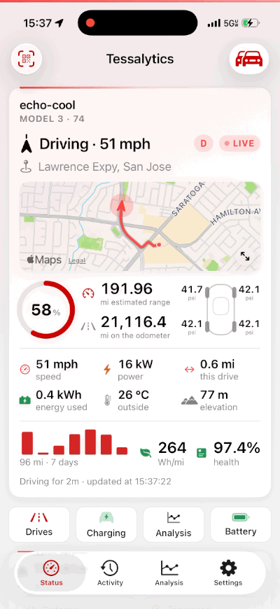
  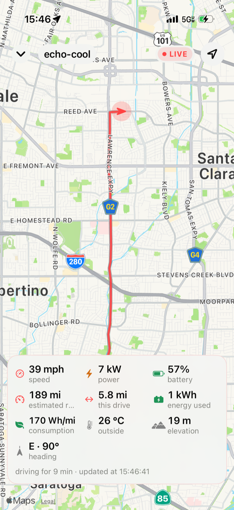
  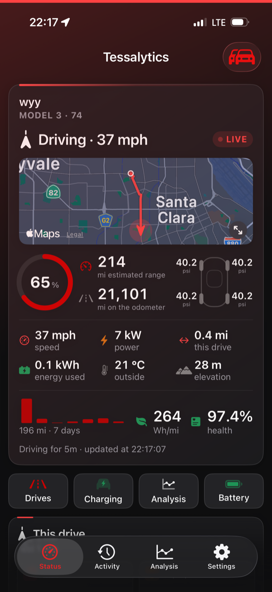
  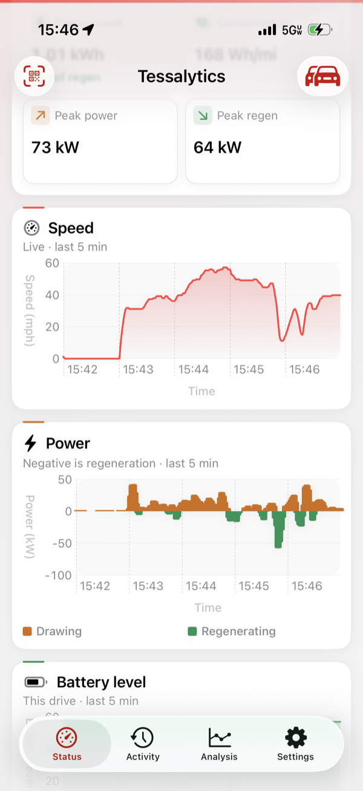
</p>

Same drive, from the car's own cameras beside the app:

<p align="center">
  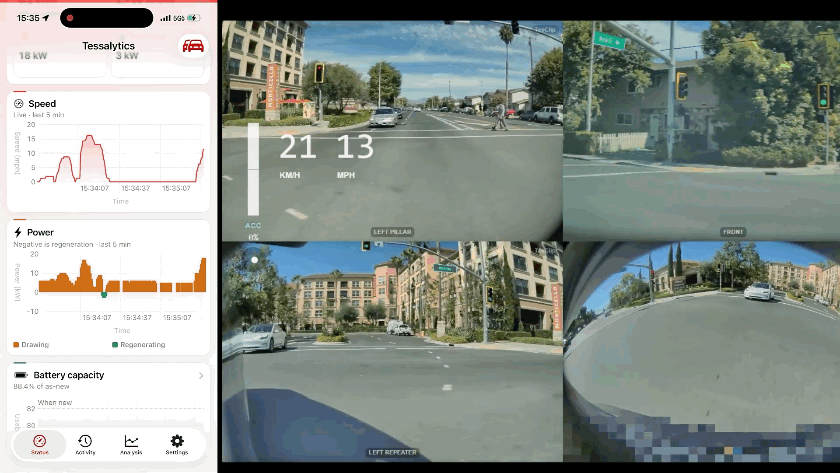
</p>

## History and analysis

<p align="center">
  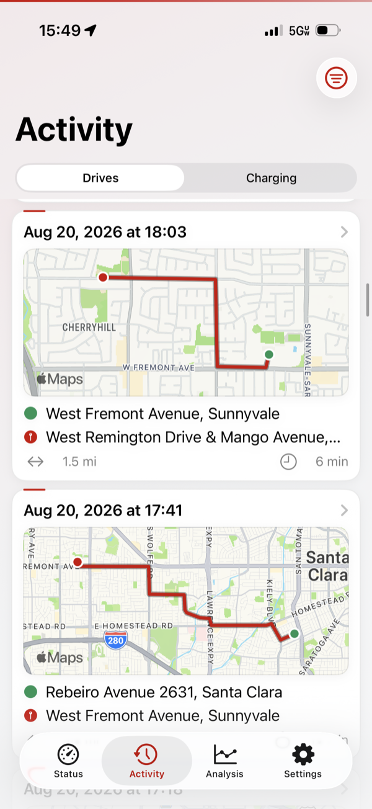
  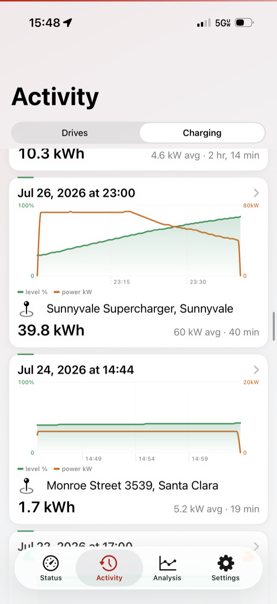
  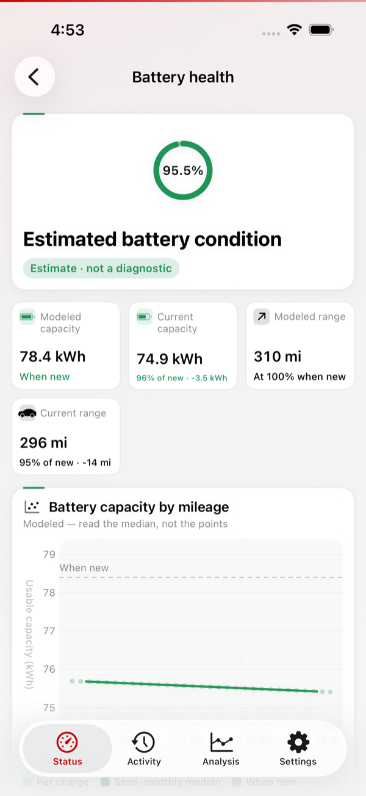
  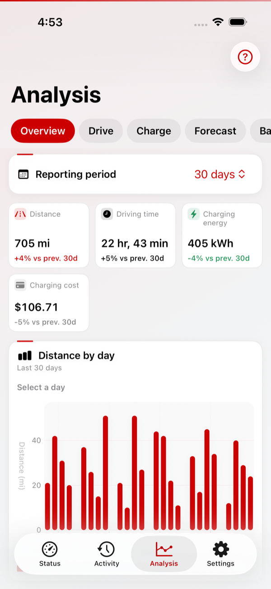
</p>

<p align="center">
  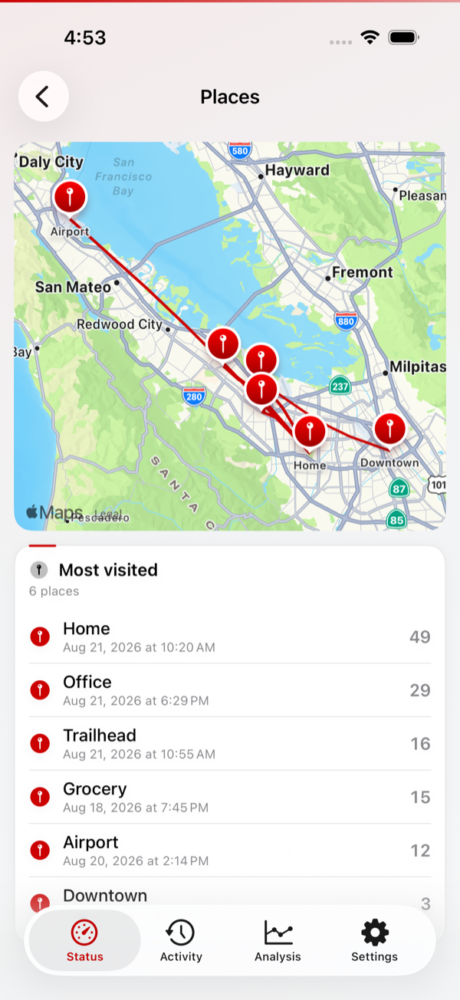
  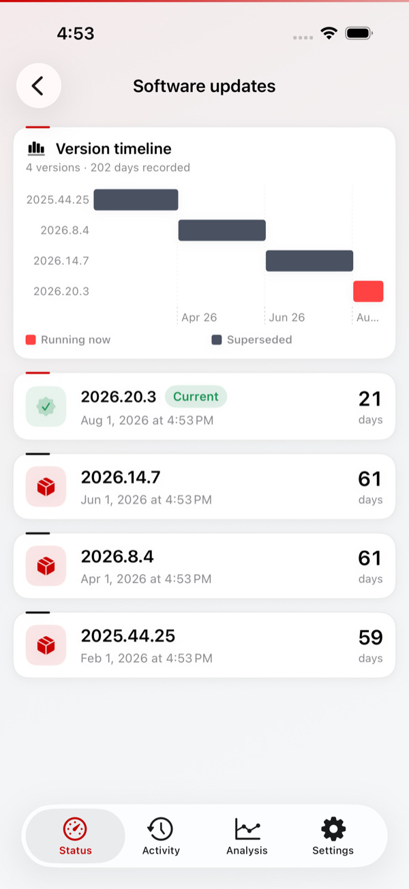
  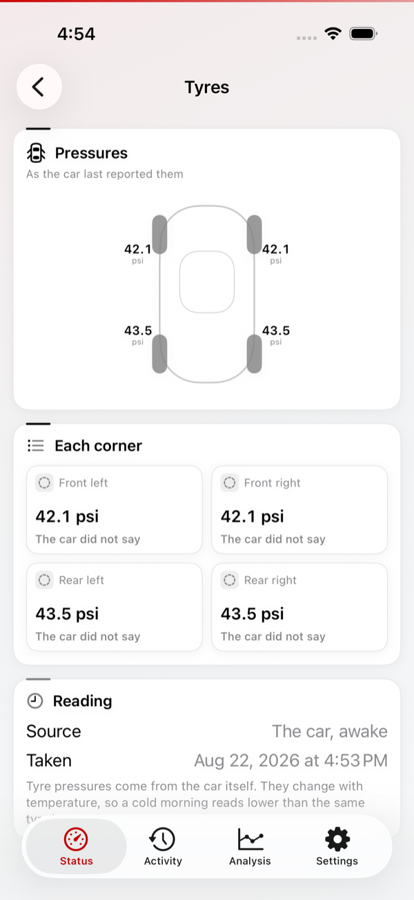
  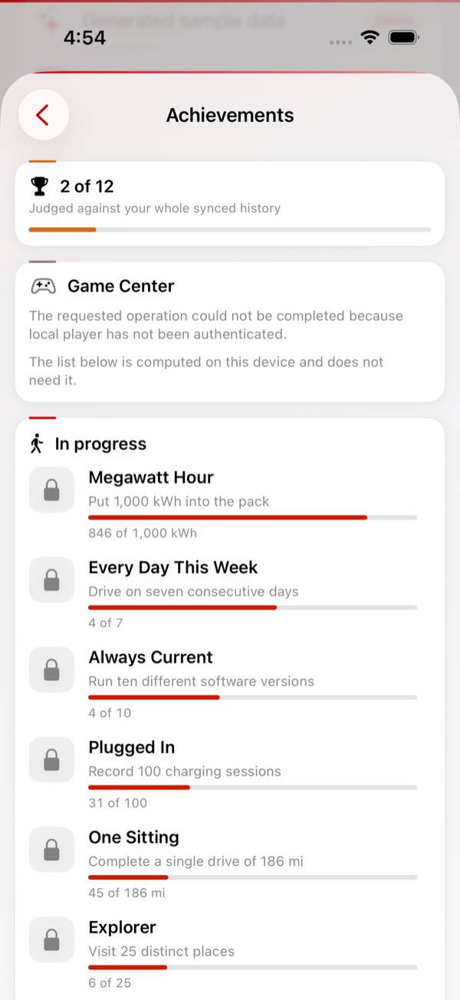
</p>

## The car itself

Tap the name on the home screen for the car's own settings. Its VIN names the model,
the factory and the model year, and a shipped table turns those into the pack it was
built with — the figure every health estimate divides by. Twelve achievements sit
alongside, computed on the device and reported to Game Center when you are signed in.

<p align="center">
  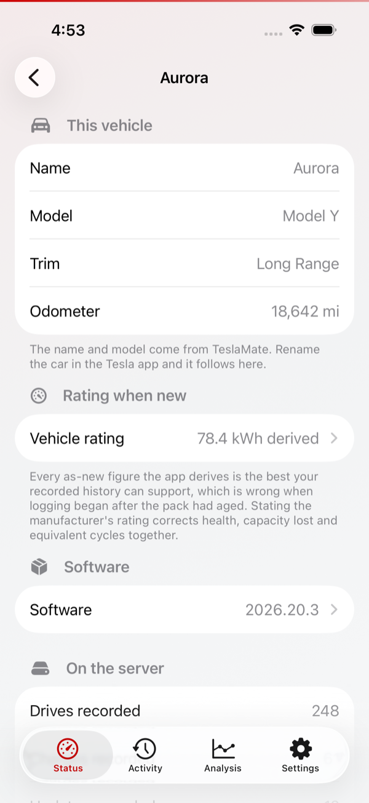
  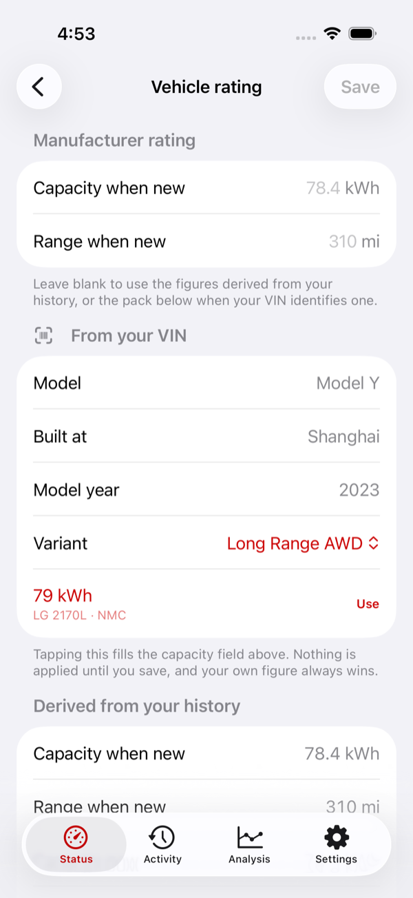
  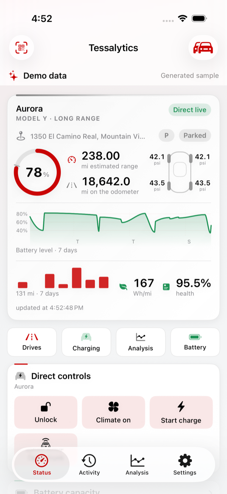
  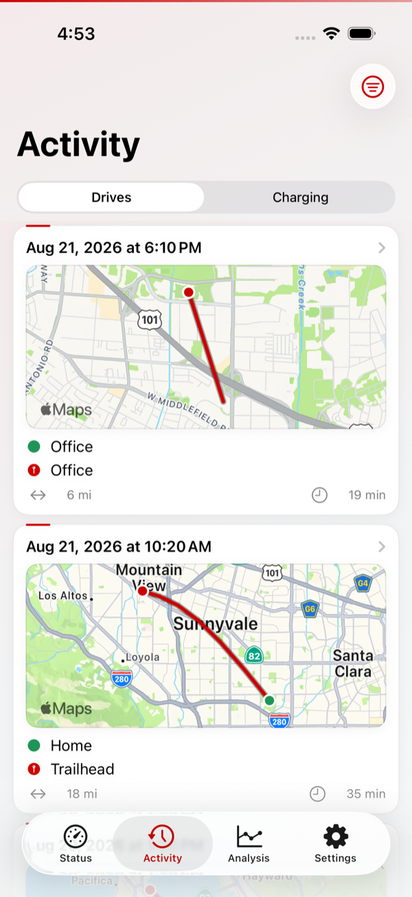
</p>

> The live-driving captures are from a real car and show real routes and addresses.
> Everything else uses generated demo data — no real vehicle, VIN, server or credential.

## What Tessalytics does

- Shows live or last-reported battery, range, location, climate, security, charging, odometer, tire pressure, and software state
- Labels freshness honestly as live, direct live, stale, asleep, offline, or unavailable
- Caches the last known status plus drive and charging history for immediate startup and offline browsing
- Displays route maps, speed and power charts, charging curves, energy, cost, and efficiency
- Builds native analytics for distance, driving time, charging energy, cost, destinations, and data coverage
- Estimates battery capacity, range, and health with explicit “estimate, not diagnostic” language
- Forecasts travel, charging time, charging cost, and efficiency from synchronized history
- Creates optional local alerts for low battery, charge completion, software updates, and notable changes
- Signs a browser in to the [web dashboard](https://github.com/echo-cool/tessalytics-web) by scanning a QR code, so the car's own screen never has to be given a token
- Supports multiple TeslaMate servers and multiple vehicles
- Supports Bearer token, HTTP Basic, and explicitly private/VPN-only connections
- Includes an on-device demo with generated status, routes, charging sessions, analytics, battery trends, and forecasts
- Optionally connects to the unofficial Owner API with a refresh token for live state and confirmed controls
- Protects every direct command with confirmation and Face ID or the device passcode

## Explore without a Tesla

On first launch, tap **Explore Demo** to open the complete app without a Tesla, Tesla account, TeslaMate server, or network connection. Tessalytics generates about two months of sample drives and charging sessions on the device, including route and charging details, software history, analytics, battery trends, and predictions.

Demo mode is clearly labeled and never enables direct vehicle commands. It remains available after relaunch; use **Settings → Connect a real server** or **Leave demo** when ready. Existing server profiles remain saved if a configured user temporarily enters the demo.

## Requirements

The generated demo requires only iOS 18 or later. To use Tessalytics with your own vehicle data you need:

1. A working [TeslaMate](https://github.com/teslamate-org/teslamate) installation
2. [Tessalytics Backend](https://github.com/echo-cool/tessalytics-backend) deployed beside TeslaMate
3. Secure network access from the iPhone to the backend
4. iOS 18 or later

To build from source you also need Xcode 16 or later. The app has no third-party runtime dependencies.

> [!WARNING]
> Tessalytics Backend requires a bearer token on every route, but a token alone is not a security boundary. If the service is reachable outside a trusted private network, put a VPN or an authenticating reverse proxy in front of it as well.

Never expose PostgreSQL, Mosquitto/MQTT, Tesla account tokens, or an unprotected API service.

## Deploy the backend

Tessalytics reads from Tessalytics Backend, a read-only HTTP service over the TeslaMate database. TeslaMate continues to collect vehicle data; Tessalytics never asks the backend to wake the vehicle.

```text
Tesla vehicle
    ↓
TeslaMate ── PostgreSQL history
    │
    └────── MQTT live snapshot
                 ↓
      Tessalytics Backend
                 ↓
       VPN or authenticated HTTPS
                 ↓
             Tessalytics
```

### 1. Add Tessalytics Backend

TeslaMate alone does not serve this API, so the backend is not optional. It runs as one more service in the TeslaMate Compose project — see the [Tessalytics Backend](https://github.com/echo-cool/tessalytics-backend) repository for the full guide, including a complete Compose file for a fresh TeslaMate install. Added to an existing stack, the service looks like this; replace every placeholder and adapt the database/MQTT service names to your TeslaMate stack.

```yaml
services:
  tessalytics-backend:
    image: echocool/tessalytics-backend:latest   # published; nothing to build
    restart: unless-stopped
    ports:
      - 3022:8080
    depends_on:
      - database
      - mosquitto
    environment:
      DATABASE_USER: "${DATABASE_USER}"
      DATABASE_PASS: "${DATABASE_PASSWORD}"
      DATABASE_NAME: "${DATABASE_NAME}"
      DATABASE_HOST: database
      MQTT_HOST: mosquitto
      API_TOKEN: "${TESSALYTICS_API_TOKEN}"
      TIMEZONE: "${TIME_ZONE}"
```

`ports: 3022:8080` publishes the service on port 3022 of **every** host interface, which is convenient on a home LAN and is the reason the next step is not optional. If the host is reachable from the internet, either bind it to one interface (`127.0.0.1:3022:8080`) and put a reverse proxy in front, or drop the `ports` block for `expose: ["8080"]` and reach the service only from inside the Compose network. The API answers with a complete location history; a bearer token is the only thing between it and whoever finds the port.

### 2. Protect every route

Choose one of these patterns:

- **Private network:** Tailscale, WireGuard, or another authenticated VPN with no public API listener
- **HTTPS reverse proxy:** Caddy, nginx, or Traefik with authentication applied to every backend route
- **HTTP Basic authentication:** supported directly by Tessalytics
- **Bearer authentication:** enforce `Authorization: Bearer <TOKEN>` at the reverse proxy

Use a publicly trusted certificate for public hostnames. Tessalytics never disables TLS verification and never accepts an “allow any certificate” mode.

### 3. Verify the deployment

Before adding the server in Tessalytics, verify:

1. `/api/ping` is reachable as intended.
2. `/v1/vehicles` rejects missing or incorrect proxy credentials.
3. `/v1/vehicles` succeeds with the intended credentials.
4. PostgreSQL and MQTT are not reachable from the public network.

See [Backend setup](docs/backend-setup.md) for more security and reverse-proxy guidance.

## Install

**[Join the TestFlight beta](https://testflight.apple.com/join/41U7UpWr)** — no Xcode, no
signing, no developer account. You still need a TeslaMate installation and the backend
above; the app is a client and has nothing to show without them.

## Build it yourself

The generated Xcode project is checked in. [XcodeGen](https://github.com/yonaskolb/XcodeGen) is only required after changing `project.yml`.

```sh
git clone https://github.com/echo-cool/tessalytics-ios.git
cd tessalytics-ios
open Tessalytics.xcodeproj
```

In Xcode:

1. Select the `Tessalytics` scheme.
2. Choose an iPhone simulator or a signed physical iPhone.
3. Select your development team if Xcode asks for signing.
4. Run the app.

Command-line build:

```sh
xcodebuild -project Tessalytics.xcodeproj \
  -scheme Tessalytics \
  -destination 'generic/platform=iOS Simulator' \
  build
```

After editing `project.yml`, regenerate the project with:

```sh
xcodegen generate
```

## Connect the app

1. Open Tessalytics and tap **Configure server**, or tap **Explore Demo** to try the app first.
2. Enter a profile name and the protected Tessalytics Backend base URL. This is the backend's address, not TeslaMate's port 4000 or Grafana's port 3000.
3. Select Bearer token, HTTP Basic, or no application authentication.
4. Use no authentication only for a deliberately private VPN/local deployment.
5. Tap **Test Connection**. Tessalytics checks reachability, credentials, API compatibility, and vehicle discovery.
6. Save the verified profile. Credentials are stored in Keychain, not SwiftData or `UserDefaults`.

Remote endpoints must use HTTPS. Local HTTP is available only when explicitly enabled for common private-network or localhost addresses.

## Use the app

### Status

The Status tab prioritizes the current vehicle state, battery, estimated range, freshness, security, climate, location, charging progress, a recent-driving chart, and compact server metrics. Cached values appear first while a deduplicated refresh continues in the background, so a slow server does not leave the screen or pull-to-refresh control blocked. Tessalytics polls only while the dashboard is visible and the app is foregrounded.

### Activity

Use Activity to browse synchronized drives and charging sessions. Drive cards include compact route-map previews, lists load incrementally, and synchronized data remains available offline. Open a completed drive for its route and sample charts, or a charge for energy, power, current, voltage, efficiency, and cost.

### Analysis

Use the mode bar to switch between overview, driving, charging, forecasts, and battery health. Period controls and interactive charts make trends inspectable without reproducing a Grafana dashboard inside the app.

Predictions are on-device statistical estimates based on synchronized history. They are not guarantees, safety guidance, or commands to the vehicle.

### The hero card

Every figure on it is a control that leads where the figure is about: the battery ring and the range open battery health, the odometer and the week's driving open the drive history, the tyre diagram opens the tyres, and the car's name opens its settings — which is where the manufacturer's rating lives. The gear the car reports (P, D, R, N) sits beside the state.

### Live driving

While a drive is in progress the Status tab shows the route so far on a map, the speed, power and consumption as they change, and where the car is — the road it is on while it moves, the street address while it is standing. A car stopped at a light says "Stopped" rather than "Driving · 0 mph", because a screen that reads as frozen is worse than one that says what is happening.

If your server reports what is steering, a badge next to the location says so — blue for Full Self-Driving or Autopilot, grey when the car reports driving itself is off. TeslaMate does not publish this, so on most deployments the badge is simply absent; the app never guesses.

Where the car is comes from the coordinate the server reports, reverse-geocoded on the device with MapKit and throttled so a drive costs a handful of lookups rather than one per reading. TeslaMate's geofences are deliberately not used for this: it names a place only when a *drive* ended inside one you had drawn, so a car parked anywhere else keeps reporting the last named place it visited — a home address, shown for days, for a car that is nowhere near it. A parked Tesla sleeps and stops reporting a position at all, so the card falls back to the last position reported while it was awake — it has not moved since. When nothing resolves at all, the line is hidden rather than guessed at.

### Signing a browser in to the car's screen

The backend can also serve a [wide dashboard](https://github.com/echo-cool/tessalytics-web) meant for the car's own
browser, where a metre of screen shows at once what this app pages between. It needs a credential, and a car's
touchscreen is the last place anyone wants to type a 64-character token — so the dashboard displays a QR code and
**the scan button at the top left of the Status tab** reads it.

Before anything is granted, the app shows what it is about to approve: the pairing code to compare against the
screen, the address the request arrived at, and the browser that made it. Approving then asks for Face ID or the
device passcode, because handing over a complete location history is not a smaller decision than sending the car a
command.

What the browser receives is not this app's token. It is read-only — the server refuses vehicle actions to a paired
session, so a dashboard left open in a car cannot lock, unlock, wake or command it — and it expires, and it can be
revoked at any time from **Settings → Paired browsers**. Restarting the backend signs every browser out, because the
sessions live in its memory and nowhere else.

If the camera is unavailable, **Enter code** takes the code printed beside the QR symbol instead.

### Software history

Software updates are shown as a timeline rather than a list of version numbers and dates: a bar per version across the months it ran, and beside each version, how many days the car spent on it. TeslaMate records the moment a version was *installed*; how long it then ran is the gap between one install and the next, which the app now derives instead of leaving to the reader.

### Achievements

A dozen achievements for things the car has actually done — distance covered, a drive in one sitting, energy through the pack, a week of consecutive days, places visited, pack health held past 50,000 km. They are computed on the device from synced history and shown in Settings whether or not Game Center is available; when it is, progress is reported to Game Center as it changes. Nothing here rewards opening the app.

Distances are measured in kilometres internally whatever your display units, so a target cannot move when a preference does.

### Settings

Settings switches servers and vehicles, manages notifications, displays software history and privacy information, and adds optional direct connectivity.

Tapping the version number five times turns on **debug mode**: a screen showing the live state exactly as the app holds it, the connection's health, an optional recording of every raw event the server sends, and an export you can share. The export is redacted — tokens, VINs and coordinates are stripped before the file leaves the device. Turning debug mode off clears the log and hides the screen again.

### Optional direct live data and controls

Tessalytics accepts an Owner API **refresh token** generated outside the app and exchanges it for an access token itself — there is nothing else to paste. It never asks for a Tesla password. Both tokens are stored in device-only Keychain protection, refresh rotation is persisted securely, and commands require a second confirmation plus device-owner authentication.

The Owner API is unofficial and may change or stop working. Connecting it is optional; TeslaMate analytics work without it. When no valid token and live connection are present, direct-control actions are not shown. Direct commands may wake the vehicle and should be used deliberately.

Tesla changes this API without notice, and the app is written to say so plainly when it does. The account's cars are read from `/api/1/products` rather than `/api/1/vehicles`, which has answered `412 Precondition Failed` since January 2023; a `412` from anywhere else is reported as itself rather than as an unexpected status, because there is nothing an owner can do about it and a clear message is worth more than a retry.

## Privacy and security

- No Tessalytics cloud, account, ads, telemetry, or analytics SDK
- Backend credentials use Keychain After First Unlock for authorized refresh
- Owner API credentials use When Unlocked, This Device Only
- Historical records are cached locally with SwiftData for offline access
- Secrets, VINs, coordinates, addresses, and private deployment URLs are excluded from fixtures and logs
- TLS certificate validation is never bypassed
- Owner API credentials can be disconnected and removed from the device in Settings
- The camera is used only to read a pairing QR code: no image is stored, and nothing is sent anywhere
- A browser paired from this app gets read-only access, and it never sees this app's server token

Read the full [Privacy Policy](PRIVACY.md) and [Security Policy](SECURITY.md). Report vulnerabilities privately according to `SECURITY.md`, not in a public issue.

## Development

The app is built with Swift 6, SwiftUI, Observation, structured concurrency, URLSession, Codable, SwiftData, MapKit, Swift Charts, UserNotifications, Security, XCTest, and XCUITest.

```text
SwiftUI features
    ↓
Repositories and analysis services
    ↓
Backend client ─────────── Keychain credentials
Owner API session actor ─── SwiftData offline cache
    ↓
URLSession
```

More detail:

- [Architecture](docs/architecture.md)
- [API compatibility](docs/api-compatibility.md)
- [Intelligence methodology](docs/intelligence.md)
- [Design system](docs/design-system.md)
- [Testing](docs/testing.md)

Run the deterministic test suite:

```sh
xcodebuild -project Tessalytics.xcodeproj \
  -scheme Tessalytics \
  -destination 'platform=iOS Simulator,name=iPhone 17 Pro' \
  test
```

Live-server tests are opt-in and prompt for credentials so secrets are never committed. See [Testing](docs/testing.md).

Live mode can be exercised without a moving car. `-ui-demo -ui-demo-driving` shows one frozen instant of a journey; adding `-ui-demo-driving-live` advances it at the rate a car publishes, through an acceleration, a red light and a stretch of Full Self-Driving. Adding `-ui-demo-gappy-readings` makes a third of those readings arrive with no position at all, which is the fault that used to make the map on the home screen flash.

## Contributing

Contributions are welcome. Start with [CONTRIBUTING.md](CONTRIBUTING.md) and follow the [Code of Conduct](CODE_OF_CONDUCT.md). Please include unit tests and UI tests for user-visible features.

TeslaMate is a separate project. Review the [TeslaMate trademark policy](https://github.com/teslamate-org/teslamate/blob/main/TRADEMARK.md) before proposing branding changes.

## Known limitations

- Current status freshness depends on TeslaMate and can represent the last available poll.
- Historical pagination has no total count, so end-of-list detection is heuristic.
- Available fields vary between TeslaMate versions and installations.
- Battery health and predictions are estimates affected by data quality, weather, calibration, and driving history.
- Custom certificate authorities are not currently supported.
- The optional Owner API is unofficial and is not part of TeslaMate.

## Related projects

| | |
| --- | --- |
| [tessalytics-ios](https://github.com/echo-cool/tessalytics-ios) | This app. [TestFlight](https://testflight.apple.com/join/41U7UpWr) |
| [tessalytics-backend](https://github.com/echo-cool/tessalytics-backend) | The read-only API it reads from. Published as `echocool/tessalytics-backend` |
| [tessalytics-web](https://github.com/echo-cool/tessalytics-web) | The same data on the car's own browser |

## License

Tessalytics is open source under the [MIT License](LICENSE).
