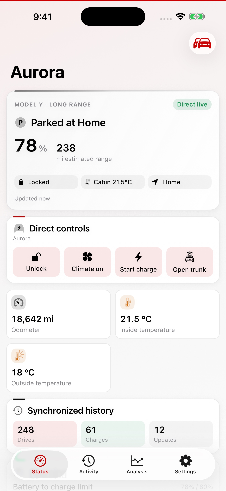
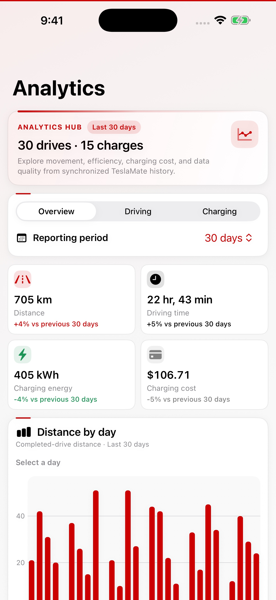
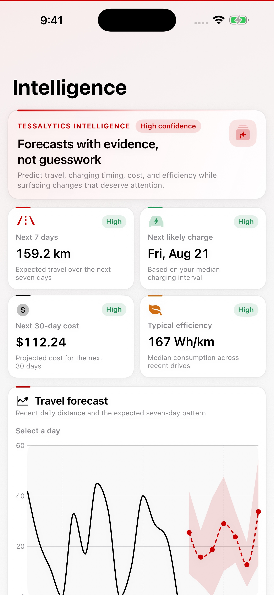
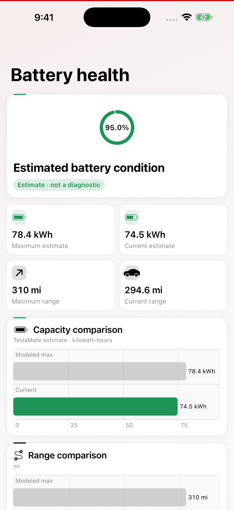
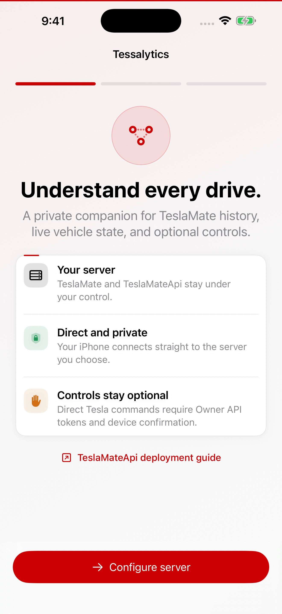

<p align="center">
  
</p>

<h1 align="center">Tessalytics: TeslaMate Client</h1>

<p align="center"><strong>Understand every drive.</strong></p>

<p align="center">
  
  
  
  
</p>

Tessalytics is a privacy-focused native iPhone companion for a self-hosted [TeslaMate](https://github.com/teslamate-org/teslamate) installation. It turns data from [Tessalytics Backend](https://github.com/echo-cool/tessalytics-backend) into a compact vehicle dashboard, searchable history, native charts, battery-health estimates, predictions, and local notifications.

Your iPhone connects directly to infrastructure you control. Tessalytics has no developer-operated cloud, advertising, analytics SDK, or tracking.

> [!IMPORTANT]
> **A standalone TeslaMate installation will not work with this app.** Tessalytics talks to [Tessalytics Backend](https://github.com/echo-cool/tessalytics-backend), a read-only API service you deploy beside TeslaMate — the same Docker Compose file is fine. The server address you enter in the app is the backend's, not TeslaMate's or Grafana's.

> [!IMPORTANT]
> Tessalytics is an unofficial community tool and is not affiliated with, endorsed by, or supported by the official TeslaMate project or Tesla, Inc.

## Screenshots

<p align="center">
  
  
  
  
  
</p>

The screenshots use generated demo data. No real vehicle, location, route, server, VIN, or credential is included.

## What Tessalytics does

- Shows live or last-reported battery, range, location, climate, security, charging, odometer, tire pressure, and software state
- Labels freshness honestly as live, direct live, stale, asleep, offline, or unavailable
- Caches the last known status plus drive and charging history for immediate startup and offline browsing
- Displays route maps, speed and power charts, charging curves, energy, cost, and efficiency
- Builds native analytics for distance, driving time, charging energy, cost, destinations, and data coverage
- Estimates battery capacity, range, and health with explicit “estimate, not diagnostic” language
- Forecasts travel, charging time, charging cost, and efficiency from synchronized history
- Creates optional local alerts for low battery, charge completion, software updates, and notable changes
- Supports multiple TeslaMate servers and multiple vehicles
- Supports Bearer token, HTTP Basic, and explicitly private/VPN-only connections
- Includes an on-device demo with generated status, routes, charging sessions, analytics, battery trends, and forecasts
- Optionally connects to the unofficial Owner API using an access/refresh-token pair for live state and confirmed controls
- Protects every direct command with confirmation and Face ID or the device passcode

## Explore without a Tesla

On first launch, tap **Explore Demo** to open the complete app without a Tesla, Tesla account, TeslaMate server, or network connection. Tessalytics generates about two months of sample drives and charging sessions on the device, including route and charging details, software history, analytics, battery trends, and predictions.

Demo mode is clearly labeled and never enables direct vehicle commands. It remains available after relaunch; use **Settings → Connect a real server** or **Leave demo** when ready. Existing server profiles remain saved if a configured user temporarily enters the demo.

## Requirements

The generated demo requires only iOS 18 or later. To use Tessalytics with your own vehicle data you need:

1. A working [TeslaMate](https://github.com/teslamate-org/teslamate) installation
2. [Tessalytics Backend](https://github.com/echo-cool/tessalytics-backend) deployed beside TeslaMate
3. Secure network access from the iPhone to the backend
4. iOS 18 or later

To build from source you also need Xcode 16 or later. The app has no third-party runtime dependencies.

> [!WARNING]
> Tessalytics Backend requires a bearer token on every route, but a token alone is not a security boundary. If the service is reachable outside a trusted private network, put a VPN or an authenticating reverse proxy in front of it as well.

Never expose PostgreSQL, Mosquitto/MQTT, Tesla account tokens, or an unprotected API service.

## Deploy the backend

Tessalytics reads from Tessalytics Backend, a read-only HTTP service over the TeslaMate database. TeslaMate continues to collect vehicle data; Tessalytics never asks the backend to wake the vehicle.

```text
Tesla vehicle
    ↓
TeslaMate ── PostgreSQL history
    │
    └────── MQTT live snapshot
                 ↓
      Tessalytics Backend
                 ↓
       VPN or authenticated HTTPS
                 ↓
             Tessalytics
```

### 1. Add Tessalytics Backend

TeslaMate alone does not serve this API, so the backend is not optional. It runs as one more service in the TeslaMate Compose project — see the [Tessalytics Backend](https://github.com/echo-cool/tessalytics-backend) repository for the full guide, including a complete Compose file for a fresh TeslaMate install. Added to an existing stack, the service looks like this; replace every placeholder and adapt the database/MQTT service names to your TeslaMate stack.

```yaml
services:
  tessalytics-backend:
    build:
      context: ./tessalytics-backend      # git clone beside docker-compose.yml
      dockerfile: docker/Dockerfile
    restart: unless-stopped
    ports:
      - 3022:8080
    depends_on:
      - database
      - mosquitto
    environment:
      DATABASE_USER: "${DATABASE_USER}"
      DATABASE_PASS: "${DATABASE_PASSWORD}"
      DATABASE_NAME: "${DATABASE_NAME}"
      DATABASE_HOST: database
      MQTT_HOST: mosquitto
      API_TOKEN: "${TESSALYTICS_API_TOKEN}"
      TIMEZONE: "${TIME_ZONE}"
```

`expose` keeps the service on the Compose network instead of publishing it on every host interface.

### 2. Protect every route

Choose one of these patterns:

- **Private network:** Tailscale, WireGuard, or another authenticated VPN with no public API listener
- **HTTPS reverse proxy:** Caddy, nginx, or Traefik with authentication applied to every backend route
- **HTTP Basic authentication:** supported directly by Tessalytics
- **Bearer authentication:** enforce `Authorization: Bearer <TOKEN>` at the reverse proxy

Use a publicly trusted certificate for public hostnames. Tessalytics never disables TLS verification and never accepts an “allow any certificate” mode.

### 3. Verify the deployment

Before adding the server in Tessalytics, verify:

1. `/api/ping` is reachable as intended.
2. `/v1/vehicles` rejects missing or incorrect proxy credentials.
3. `/v1/vehicles` succeeds with the intended credentials.
4. PostgreSQL and MQTT are not reachable from the public network.

See [Backend setup](docs/backend-setup.md) for more security and reverse-proxy guidance.

## Build and install

The generated Xcode project is checked in. [XcodeGen](https://github.com/yonaskolb/XcodeGen) is only required after changing `project.yml`.

```sh
git clone https://github.com/echo-cool/tessalytics-ios.git
cd tessalytics-ios
open Tessalytics.xcodeproj
```

In Xcode:

1. Select the `Tessalytics` scheme.
2. Choose an iPhone simulator or a signed physical iPhone.
3. Select your development team if Xcode asks for signing.
4. Run the app.

Command-line build:

```sh
xcodebuild -project Tessalytics.xcodeproj \
  -scheme Tessalytics \
  -destination 'generic/platform=iOS Simulator' \
  build
```

After editing `project.yml`, regenerate the project with:

```sh
xcodegen generate
```

## Connect the app

1. Open Tessalytics and tap **Configure server**, or tap **Explore Demo** to try the app first.
2. Enter a profile name and the protected Tessalytics Backend base URL. This is the backend's address, not TeslaMate's port 4000 or Grafana's port 3000.
3. Select Bearer token, HTTP Basic, or no application authentication.
4. Use no authentication only for a deliberately private VPN/local deployment.
5. Tap **Test Connection**. Tessalytics checks reachability, credentials, API compatibility, and vehicle discovery.
6. Save the verified profile. Credentials are stored in Keychain, not SwiftData or `UserDefaults`.

Remote endpoints must use HTTPS. Local HTTP is available only when explicitly enabled for common private-network or localhost addresses.

## Use the app

### Status

The Status tab prioritizes the current vehicle state, battery, estimated range, freshness, security, climate, location, charging progress, a recent-driving chart, and compact server metrics. Cached values appear first while a deduplicated refresh continues in the background, so a slow server does not leave the screen or pull-to-refresh control blocked. Tessalytics polls only while the dashboard is visible and the app is foregrounded.

### Activity

Use Activity to browse synchronized drives and charging sessions. Drive cards include compact route-map previews, lists load incrementally, and synchronized data remains available offline. Open a completed drive for its route and sample charts, or a charge for energy, power, current, voltage, efficiency, and cost.

### Analysis

Use the mode bar to switch between overview, driving, charging, forecasts, and battery health. Period controls and interactive charts make trends inspectable without reproducing a Grafana dashboard inside the app.

Predictions are on-device statistical estimates based on synchronized history. They are not guarantees, safety guidance, or commands to the vehicle.

### Live driving

While a drive is in progress the Status tab shows the route so far on a map, the speed, power and consumption as they change, and where the car is — the road it is on while it moves, the street address while it is standing. A car stopped at a light says "Stopped" rather than "Driving · 0 mph", because a screen that reads as frozen is worse than one that says what is happening.

If your server reports what is steering, a badge next to the location says so — blue for Full Self-Driving or Autopilot, grey when the car reports driving itself is off. TeslaMate does not publish this, so on most deployments the badge is simply absent; the app never guesses.

Where the car is comes from the coordinate the server reports, resolved on the device and throttled so a drive costs a handful of lookups rather than one per reading. A geofence you have drawn always wins: "Home" is what you called the place.

### Settings

Settings switches servers and vehicles, manages notifications, displays software history and privacy information, and adds optional direct connectivity.

Tapping the version number five times turns on **debug mode**: a screen showing the live state exactly as the app holds it, the connection's health, an optional recording of every raw event the server sends, and an export you can share. The export is redacted — tokens, VINs and coordinates are stripped before the file leaves the device. Turning debug mode off clears the log and hides the screen again.

### Optional direct live data and controls

Tessalytics can accept an Owner API access token and refresh token generated outside the app. It never asks for a Tesla password. Tokens are stored in device-only Keychain protection, refresh rotation is persisted securely, and commands require a second confirmation plus device-owner authentication.

The Owner API is unofficial and may change or stop working. Connecting it is optional; TeslaMate analytics work without it. When no valid token pair and live connection are present, direct-control actions are not shown. Direct commands may wake the vehicle and should be used deliberately.

## Privacy and security

- No Tessalytics cloud, account, ads, telemetry, or analytics SDK
- Backend credentials use Keychain After First Unlock for authorized refresh
- Owner API credentials use When Unlocked, This Device Only
- Historical records are cached locally with SwiftData for offline access
- Secrets, VINs, coordinates, addresses, and private deployment URLs are excluded from fixtures and logs
- TLS certificate validation is never bypassed
- Owner API credentials can be disconnected and removed from the device in Settings

Read the full [Privacy Policy](PRIVACY.md) and [Security Policy](SECURITY.md). Report vulnerabilities privately according to `SECURITY.md`, not in a public issue.

## Development

The app is built with Swift 6, SwiftUI, Observation, structured concurrency, URLSession, Codable, SwiftData, MapKit, Swift Charts, UserNotifications, Security, XCTest, and XCUITest.

```text
SwiftUI features
    ↓
Repositories and analysis services
    ↓
Backend client ─────────── Keychain credentials
Owner API session actor ─── SwiftData offline cache
    ↓
URLSession
```

More detail:

- [Architecture](docs/architecture.md)
- [API compatibility](docs/api-compatibility.md)
- [Intelligence methodology](docs/intelligence.md)
- [Design system](docs/design-system.md)
- [Testing](docs/testing.md)

Run the deterministic test suite:

```sh
xcodebuild -project Tessalytics.xcodeproj \
  -scheme Tessalytics \
  -destination 'platform=iOS Simulator,name=iPhone 17 Pro' \
  test
```

Live-server tests are opt-in and prompt for credentials so secrets are never committed. See [Testing](docs/testing.md).

Live mode can be exercised without a moving car. `-ui-demo -ui-demo-driving` shows one frozen instant of a journey; adding `-ui-demo-driving-live` advances it at the rate a car publishes, through an acceleration, a red light and a stretch of Full Self-Driving. Adding `-ui-demo-gappy-readings` makes a third of those readings arrive with no position at all, which is the fault that used to make the map on the home screen flash.

## Contributing

Contributions are welcome. Start with [CONTRIBUTING.md](CONTRIBUTING.md) and follow the [Code of Conduct](CODE_OF_CONDUCT.md). Please include unit tests and UI tests for user-visible features.

TeslaMate is a separate project. Review the [TeslaMate trademark policy](https://github.com/teslamate-org/teslamate/blob/main/TRADEMARK.md) before proposing branding changes.

## Known limitations

- Current status freshness depends on TeslaMate and can represent the last available poll.
- Historical pagination has no total count, so end-of-list detection is heuristic.
- Available fields vary between TeslaMate versions and installations.
- Battery health and predictions are estimates affected by data quality, weather, calibration, and driving history.
- Custom certificate authorities are not currently supported.
- The optional Owner API is unofficial and is not part of TeslaMate.

## License

Tessalytics is open source under the [MIT License](LICENSE).
